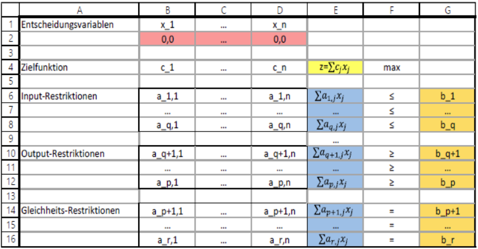

Lineare Programmierung
-----------

#### Kurzbeschreibung des Modells

Die Lineare Programmierung gehört zu den meistgenutzten Methoden der Optimierung in der Forstwirtschaft. Sie dient als Entscheidungshilfe zum optimalen Einsatz begrenzt verfügbarer Ressourcen. Dabei wird ein System aus linearen Gleichungen und Ungleichungen genutzt, um ein optimiertes Ziel zu berechnen. Die Lösung eines solchen Systems ist durch mathematische Operationen und eingeschränkt auch durch eine graphische Darstellung möglich. Die mathematischen Operationen (Berechnungen) werden in der Regel von Computerprogrammen ausgeführt, da doch meist viele Rechenschritte benötigt werden.

<h3>
<a name="menu">Inhaltsverzeichnis</a>
</h3>
<ul>
<li>
<a href="#1. Einleitung">1. Einleitung</a>
</li>
<li>
<a href="#2. Grundlegende Theorie">2. Grundlegende Theorie</a>
</li>
<li>
<a href="#3. Input und Output">3. Input und Output</a>
</li>
<li>
<a href="#4. Aufbau des Modells">4. Aufbau des Modells</a>
</li>
<li>
<a href="#5. Hinweise zur Anwendung">5. Hinweise zur Anwendung</a>
</li>
<li>
<a href="#6. Beispielhafte Anwendung">6. Beispielhafte Anwendung</a>
</li>
<li>
<a href="#7. Literatur">7. Literatur</a>
</li>
</ul>

<h3>
<a name="1. Einleitung">1. Einleitung</a>
</h3>

Die Lineare Programmierung gehört zu den meistgenutzten Methoden der Optimierung in der Forstwirtschaft. Optimierungsmethoden dienen als Entscheidungshilfe beim Einsatz begrenzter Ressourcen um ein bestmögliches Ergebnis unter gegebenen Bedingungen zu erhalten. 

Als einer der bekanntesten Pioniere der Linearen Programmierung zählt George Dantzig. Dieser entwickelte die lineare Programmierung in den 1940er Jahren entscheidend. Anwendung fand diese Methode beispielsweise im 2. Weltkrieg, um den militärischen Einsatz zu optimieren.  Heutzutage ist die Lineare Programmierung eines der Hauptverfahren des Operation Research und findet beispielsweise Anwendung in der Produktionsplanung.

<h3>
<a name="2. Grundlegende Theorie">2. Grundlegende Theorie</a>
</h3>

Unter einem linearen Programm ist ein System linearer mathematischer Gleichungen und Ungleichungen (Koeffizienten und Variablen) zu verstehen. Dabei besteht ein Optimierungssystem meist aus

- Entscheidungsvariablen (unabhängig)
- Zielfunktion mit Zielvariable (abhängig) und Konstanten (unabhängig) und
- Restriktionen (Regeln).

**Entscheidungsvariablen** werden in einem Optimierungssystem verändert, um die Zielfunktion zu maximieren, minimieren oder einen bestimmten Wert annehmen zu lassen. Daher sind diese Variablen unabhängig. Eine Entscheidungsvariable ist beispielsweise die benötigte Fläche oder benötigte Stunden in der Pflanzung oder Holzernte. 

Eine lineare **Zielfunktion** folgt beispielsweise der mathematischen Form 

_**Z = c1x1 + c2x2 + ... + cnxn**_

Dabei entspricht _Z_ der Zielvariablen, welche maximiert, minimiert oder einen bestimmten Wert annehmen soll, _c_ den Konstanten und _x_ den Entscheidungsvariablen. Eine Entscheidungsvariable könnte beispielsweise die benötigten Stunden in der Pflanzung sein und eine Konstante die Kosten, die eine Pflanzstunde kostet.

**Restriktionen** dienen bei einem linearen Programm als Begrenzung der möglichen Entscheidungen. Sie definieren Grenzen, die die Entscheidungsvariablen begrenzt. Dabei können allgemein 3 Restriktionsarten unterschieden werden:

- Input-Restriktion: maximal verfügbare Entscheidungsvariable z.B. stehen bei einer Pflanzung nur 15.000 Pflanzen oder nur 3 ha Fläche zur Verfügung

- Output-Restriktion: Menge, die mindestens erzeugt werden soll z.B. 150 Fm je Einschlagsmaßnahme

- Gleichheits-Restriktion: eine Restriktion soll voll erfüllt werden z.B. sollen alle Pflanzen gepflanzt werden

Eine lineare Restriktion kann beispielsweise folgende mathematische Form annehmen:

_**a1x1 + a2x2 + ... + anxn <= b**_

Dabei entspricht _a_ den Konstanten, _x_ den Entscheidungsvariablen und _b_ der Restriktionsgröße, also der Grenze, die durch die Restriktion gesetzt wird. 

Eine grundlegende Bedingung für die Lösung linearer Programme ist die Linearität der Systemzusammenhänge: ändert sich ein Parameter, verändert sich ein anderer dazu proportional. 

Insgesamt ergeben sich 4 Prämissen bei der Erstellung linearer Programme: Proportionalität, Addierbarkeit, Dividierbarkeit-Stetigkeit und Determinismus. 

Probleme der linearen Programmierung lassen sich sowohl durch händische mathematische Berechnungen, graphische Darstellung als auch mithilfe von computergestützten Programmen wie dem Excel Solver lösen. Für dieses Modell wird sich auf die Lösung mit dem Solver beschränkt. 

<h3>
<a name="3. Input und Output">3. Input und Output</a>
</h3>

Der <strong> Input </strong> für das Modell setzt sich zusammmen aus:

- Entscheidungsvariablen (z.B. Fläche in ha)
- Konstanten (z.B. Reinertrag je ha)
- Restriktionen (z.B. Arbeitskapazitäten und Fläche)

Aus dem Modell ergeben sich folgende <strong> Outputgrößen </strong>:

- Optimiertes Ziel (z.B. Gesamtreinertrag)

Das berechnete Ergebnis stellt das optimal beste Verhältnis der Entscheidungsvariablen unter den gegebenen Restriktionen dar. So hat man nicht nur ein optimiertes Ergebnis wie zum Beispiel den Gesamtreinertrag, sondern hat auch eine genaue Angabe zum Einsatz bzw. Höhe der Entscheidungsvariablen. Diese Ergebnisse helfen bei der Entscheidungsfindung. 

<h3>
<a name="4. Aufbau des Modells">4. Aufbau des Modells</a>
</h3>

In der folgenden Abbildung ist die Tabellenform eines linearen Programierungsproblems dargestellt. Bei der Lösung solcher Probleme hilft es, die hier abgebildete Darstellung zu verwenden, da es beim Formalisieren des Problems hilft. 

*Tabelle 1: Tabellenform eines linearen Programmierungsproblems in Excel (aus Paul, C.; Husmann, K.; Fuchs, J. (2020))* 

<h3>
<a name="5. Hinweise zur Anwendung">5. Hinweise zur Anwendung</a>
</h3>

Die Lineare Programmierung erfolgt hier mit dem Programm Microsoft Office Excel. Bei der Berechnung wird das Tool „Solver“ benötigt. Dieses Tool findet sich in der Registerkarte Daten ganz am Ende. Falls dieses Tool dort nicht erscheint, ist dieses hinzuzufügen:
Datei > Optionen > Add-Ins > unter „Verwalten“ Excel-Add-Ins wählen > Los > Solver anklicken > OK

Für die Lösung mit dem Solver ist es notwendig, dass die Zielfunktion als auch die Restriktionen durch die Entscheidungsvariablen verknüpft sind, damit der Solver das Ziel unter Änderung der Entscheidungsvariablen optimieren kann. 

Unter „Ziel festlegen“ **(grün)** wird die Zelle ausgewählt, in der hinterher das Ergebnis der Optimierung stehen soll. Diese enthält immer die Zielfunktion. 

In „Durch Ändern von Variablenzellen“ **(orange)** werden die Zellen der Entscheidungsvariablen ausgewählt. 

Die Restriktionen werden im Kästchen „Unterliegt den Nebenbedingungen“ **(blau)** eingefügt.

Als Lösungsmethode **(rot)** wählt man, da es sich um ein Problem der linearen Programmierung handelt, den Simplex-LP.

*Tabelle 2: Beispiel zur Lösung eines linearen Programmierungsproblems mit dem Excel-Solver* 

<h3>
<a name="6. Beispielhafte Anwendung">6. Beispielhafte Anwendung</a>
</h3>

Der Haupterwerbslandwirt Paul Bauer bewirtschaftet neben seinem landwirtschaftlichen
Betrieb auch einen kleinen Bauernwald. In diesem Wald ist durch einen Sturm eine 5 ha große
Windwurffläche entstanden, die Paul Bauer möglichst erfolgreich bewirtschaften möchte.
Im Rahmen seines betrieblichen Gesamtkonzeptes erscheinen zwei Alternativen sinnvoll: (1)
Bewirtschaftung als Weihnachtsbaumkultur und (2) als Pflanzkamp zur Anzucht von Buchensämlingen.
Die Weihnachtsbaumkultur lässt grundsätzlich einen jährlichen Deckungsbeitrag von 2.000,‐
Euro/ha erwarten, der Pflanzkamp von 1.500,00 Euro/ha. Aufgrund seines landwirtschaftlichen
Haupterwerbes kann Paul Bauer im ersten und zweiten Halbjahr jeweils nur 190 Stunden
für Bewirtschaftung der betreffenden forstlichen Fläche erübrigen.
In der ersten Jahreshälfte wären für die Alternative Weihnachtsbaumkultur 20 Stunden/ha
und für die Alternative Pflanzkamp 40 Stunden/ha erforderlich; in der zweiten Jahreshälfte
für die Alternative Weihnachtsbaumkultur 40 Stunden/ha und für die Alternative Pflanzkamp
20 Stunden/ ha.

Wie sieht die optimale Produktion für die Fläche aus?

1.  Formulieren Sie das Planungsproblem in Form eines linearen Gleichungs‐ bzw. Ungleichungssystems!
Lösen Sie das Problem mit Hilfe des EXCEL‐Solvers!

3.  Wie ändert sich die Produktionsentscheidung, wenn die Produktionsfläche ohne Veränderung
der Arbeitskapazität

- um 1 ha
- um 2 ha vergrößert wird?

##### Datengrundlage

[Lineare_Programmierung_Vorlage.xlsx](./Lineare_Programmierung_Vorlage.xlsx)

##### Musterlösung

[Lineare_Programmierung_Lösung.xlsx](./Lineare_Programmierung_Lösung.xlsx)

<h3>
<a name="7. Literatur">7. Literatur</a>
</h3>

<strong>Möhring, B. et al. (2020):</strong> Vorlesungsskript Forstliche Betriebswirtschaftslehre Bachelor. Abteilung Forstökonomie und Forsteinrichtung des Burckhard-Instituts, Forstliche Fakultät der Universität Göttingen

<strong >Paul, C.; Husmann, K.; Fuchs, J. (2020):</strong> Vorlesungsskript Optimierungsmethoden in der Forstplanung. Abteilung Forstökonomie und nachhaltige Landnutzungsplanung des Burckhard-Instituts, Forstliche Fakultät der Georg-August-Universität Göttingen

<a href="#menu">zurück zum Inhaltsverzeichnis</a>

